# 基于ARM平台FPGA加速的主成分分析人脸识别系统

- PB19000362 钟书锐

- PB19000071 彭怡腾

[TOC]


## 引言  

在本次2021年嵌入式嵌入式系统设计方法课程中，我们的大实验主要运用飞凌嵌入式OK6410-A开发板和Cyclone® IV FPGA 这2款硬件，实现了基于ARM平台FPGA加速的主成分分析人脸识别系统。其中ARM处理器承担大部分人脸识别的功能，FPGA只对图像预处理与人脸检测进行加速。

## 实验环境与设备

### hardware

   1. OK6410-A开发板
      - CPU:三星ARM11处理器S3C6410，主频533MHz/667MHz
      - 内存:256M Byte DDR SDRAM
      - FLASH:1G Byte SLCNand Flash
      - 系统支持:Android2.3、Linux2.6/3.0、WinCE6.0
   2. Cyclone® IV FPGA
      - 6 K 到 150 K 的逻辑单元
      - 6.3 Mb 的嵌入式存储器 
      - 360 个 18 × 18 乘法器，实现 DSP 处理密集型应用
   3. PC
      - 主板:联想 LNVNB161216 
      - 处理器:Intel(R) Core(TM) i7-10750H CPU @ 2.60GHz 2.59 GHz
      - 内存:16GB DDR4 2933MHz ( 8GB + 8GB )
      - 显卡:NVIDIA GeForce RTX 2060
   4. 摄像头
      - 谷客摄像头
      - HD98 480P

### software

   1. Quartus Prime 精简版 v21.1
   2. VMware® Workstation 15 Pro (15.5.6 build-16341506)
   3. Linux ubuntu 5.11.0-40
   4. ubuntu14.04 64位
   5. arm-linux-gcc 4.3.2
   6. opencv 2.4.10

下面图一为FPGA照片，图二为开发板照片


## 实验背景

### 人脸识别系统工作原理

人脸识别是基于人脸部的特征信息进行身份识别的一种生物识别技术。使用摄像头采集图像或视频流，通过算法在图像中检测和跟踪人脸，并对检测到的人脸进行脸部特征数据提取，进而与存储有已知身份人脸信息的数据库进行比对，最终识别出场景中单个或多个人的身份。

人脸识别系统主要由图像预处理、人脸检测、特征提取与降维、人脸特征比对识别等基本单元组成。
- 图像预处理：图像输入后，经过归一化、直方图均衡、图像灰度变换降低图像的噪声后，交后续处理。
- 人脸检测：利用人脸检测分类器，采用神经网络算法，识别给定的图片中是否存在有人脸，若有人脸存在，则给出人脸的大小、人脸个数以及人脸的位置坐标等信息。
- 特征提取与降维：提取是指抓住人脸的主要特征，适当忽略次要特征和人脸照片灰度值的细微变化，结合灰度直方图、Haar 特征、LBP 纹理特征、HOG 特征（方向梯度直方图）完成同一张人脸在不同角度、不同照明下对人脸的主要特征提取；降维主要采用 PCA 方法（主成分分析法）通过提取主要特征、过滤次要特征来提高匹配的精确度，减少特征维度，减少计算的复杂度。
- 人脸特征比对识别：使用欧氏距离公式 将人脸识别系统提取出的人脸特征数据与人脸数据库中存储的特征数据进行逐个比对，输出最终的结果。

### 人脸识别目前主流方案

人脸识别系统中图像处理主要有基于可编程逻辑器件FPGA的嵌入式系统实现、基于DSP+FPGA系统以及基于ARMSoC系统的几种实现途径。

- 方案一：基于可编程逻辑器件 FPGA 的嵌入式系统在 FPGA 中嵌入微处理器和相关外围电路来实现对图像的采集、处理、识别等功能。但对于算法的处理并不是可编程逻辑单元的强项，因此用这种方式来实现人脸识别图像处理系统的难度比较大。
- 方案二：基于 DSP + FPGA 组成系统基于 DSP+FPGA 系统，进行各种算法和图像处理的实现，FPGA 与 DSP 相 连， 通 过 DSP 处 理 器 强 大 的 I/O 功能实现系统内部的通信。FPGA 相当于 DSP 的宏功能协处理器，外围电路辅助核心电路工作。此设计方式相对灵活，并且 DSP 芯片处理数据的能力较强，适合用于实时信号的处理，在人脸识别图像处理系统中可以充分发挥其特点。
- 方案三：基于 ARM SoC 电路组成系统采用 ARM Cortex-A17 处理器系统架构，结合摄像头、eMMC 等相关外围电路来实现对图像的采集、处理、识别等功能。ARM 的优势在于速度快、功耗低、集成度高，大多数 ARM 芯片都可以算作 SoC，在外围加上电源和驱动接口即可以做成一个小型的系统。

我们准备结合方案一与方案三，主体上任然使用 ARM 平台进行加速，但是将其中的图像预处理与人脸检测部分交由FPGA实现与加速。

### OpenCV
OpenCV（开源计算机视觉库）是一个开源的BSD许可库，其中包含数百种计算机视觉算法。该文档描述了所谓的OpenCV 2.x API，它本质上是一个C ++ API，与基于C的OpenCV 1.x API相反
- OpenCV 2.X 与 OpenCV 3.X
  本次实验比较棘手的地方是opencv库环境的安装，其中主要原因还是不同版本 OpenCV的差别。
  2009年10月01日，OpenCV 2.0发布，这标志着革命性的OpenCV2时代的 来临。OpenCV 2带来了全新的C++接口，将OpenCV的能力无限放大。在2.0的 时代,OpenCV增加了新的平台支持，包括iOS和Andriod,通过CUDA和OpenCL 实现了 GPU加速，为Python和Java用户提供了接口，基于Github和Buildbot 构建了充满艺术感的持续集成系统，所以才有了被全世界的很多公司和学校所采用的稳定易用的OpenCV 2.4.x。
  2014年8月21日，OpenCV 3.0 Alpha发布，宣告着OpenCV3时代的登场。 官方更新日志中提到，OpenCV在3.0中改变了项目架构的方式，所以3.0时代不 会有像2.0时代一样激进的尝试，只会有足够稳定的改进。且不说更多眼花缭乱 的新特性，项目架构的改变是OpenCV3或为重大的革新之处。

  

## 实现步骤

### OPENCV安装

本次实验比较棘手的地方是opencv库环境的安装，下面首先交代在移植opencv库时遇到的问题，再给出我们最终成功实现移植的方法。

#### 遇到的问题

在实际安装的过程中，我们发现，opencv的版本和arm-linux-gcc的版本有一定的依赖关系，当我们尝试使用arm-linux-gcc 4.3.2去编译opencv 3.2.0的时候，我们发现在make的过程中，会报各种奇怪的错误。于是我们接下来尝试着用网上所说的arm-linux-gcc 4.5.1去编译opencv 3.2.0。这次可以编译成功了，但是将编译好的程序移植到开发板上运行的时候，我们发现会报出如下错误：

```
/usr/lib/libstdc++.so.6: version `GLIBCXX_3.4.11' not found
```

查阅资料后得知，这是因为libstdc++.so.6版本过老，网络上给出的一个解决方案是将PC机上的arm-linux-gcc 4.5.1的lib文件夹中的全部文件复制粘贴到开发板的lib文件夹中。

我们首先采用了复制的方法，但是开发板存储空间只有1GB，复制了opencv库后再复制arm-linux-gcc 4.5.1的库会使得存储空间不足，无法完成复制。

我们再采用了覆盖的方法，即对照着arm-linux-gcc 4.5.1的lib文件夹下的内容，将开发板的lib文件夹下的文件替换为最新的，再重烧文件系统。然而这样子会使得开发板上的大多数适用于arm-linux-gcc 4.3.2的软件在4.5.1的lib库下面报出

```
illegal instruction
```

这个错误使得我们甚至无法开机进入开发板的桌面。因此只有重烧开发板系统尝试其他的方法。

在经过多次失败后我们发现如下两点：

1. 为了和开发板相适应，arm-linux-gcc需要选择和开发板一致的4.3.2版本

2. 为了和arm-linux-gcc相适应，不应该选择opencv 3.x及之后的版本。

基于以上两个认识，我们最终选择了arm-linux-gcc 4.3.2交叉编译环境和opencv 2.4.10作为我们的实验环境。

#### 成功移植的方法

选定opencv和arm-linux-gcc的版本后，移植方法可基本参考其他版本的opencv的移植方法，由于在opencv2.x中，opencv_contrib和opencv是混在一起的，故还可省去一步安装opencv_contrib的过程。

此方法参考[Ubuntu上交叉编译opencv及opencv_contrib并移植到ARM板之一](https://blog.csdn.net/qq_30155503/article/details/79983630)

0. 环境准备

opencv 2.4.10 源码

arm-linux-gcc 4.3.2

ubuntu 14.04

1. 安装依赖

```sh
sudo apt-get install cmake
sudo apt-get install cmake-qt-gui
sudo apt-get install build-essential libgtk2.0-dev libavcodec-dev libavformat-dev libjpeg-dev libtiff4-dev libswscale-dev libjasper-dev
```

2. 使用cmake-gui配置opencv并生成makefile

进入cmake-gui

```sh
sudo cmake-gui
```

点击configure后选中如下选项，再点击next。

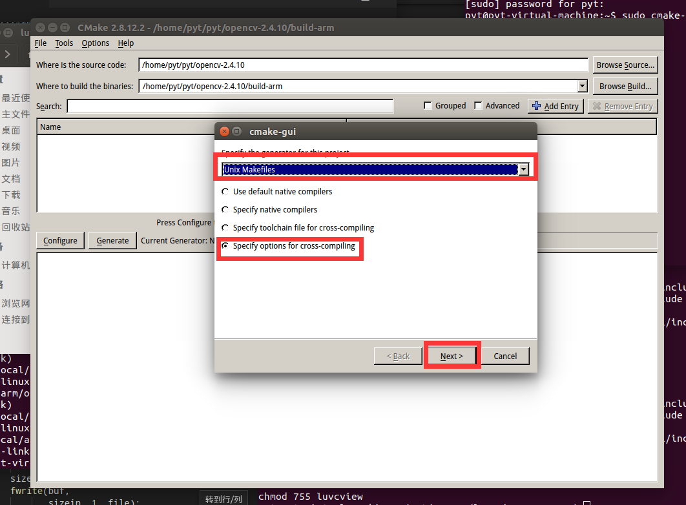

选择arm-linux-gcc的目录，并确保目标平台输入的是

```sh
arm-linux
```

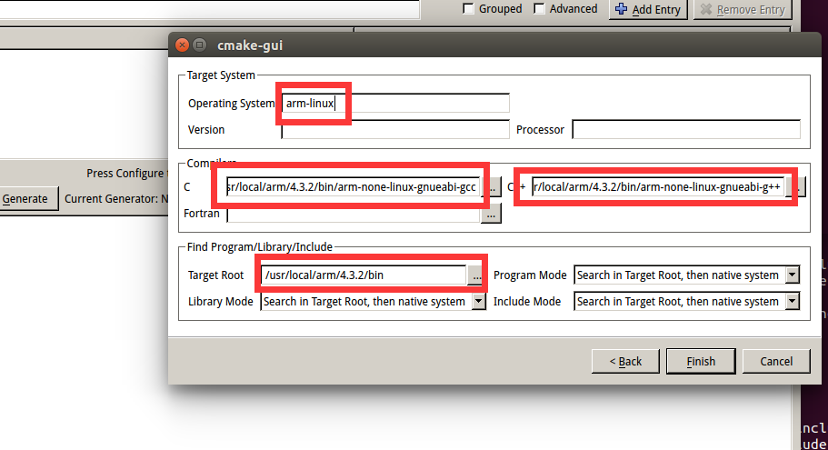

输入makefile输出的路径，并配置安装路径。

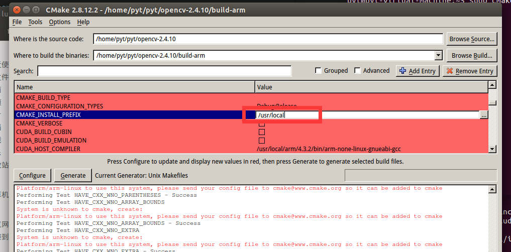

执行配置，并生成makefile

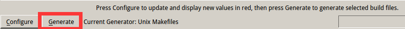

3. 修改CMakeCache.txt文件

使用gedit或其他文本编辑器打开CMakeCache.txt，将其中的

```sh
CMAKE_EXE_LINKER_FLAGS:STRING=' '
```

修改为

```sh
CMAKE_EXE_LINKER_FLAGS:STRING= -pthread -lrt -ldl
```

4. 开始编译

输入

```sh
sudo make
```

等make结束后，再输入

```sh
sudo make install
```

完成编译。

此后，可使用如下命令

```
arm-linux-g++ `pkg-config --cflags --libs opencv` train.cpp -lpthread -lrt -ldl -o train
```

编译调用了opencv库的代码。

### 摄像头模块的编写与接入
1. luvcview使用

把 luvcview拷贝到 /mnt目录下面，执行 ./luvcview -d /dev/video2  -f yuv -s 800x600 在LCD屏幕上即可看到采集到的图像。

2. luvcview源码修改

但是该版本luvcview在嵌入式开发板中不支持拍照功能（ 嵌入式版本的 luvcview，界面未增加按钮），需要阅读并修改其源码，使其能够与我们的嵌入式设备拍照保存在指定路径。

阅读源码,可知下面代码与抓取图片相关
```c
if (videoIn->getPict)
        {
            switch(videoIn->formatIn){
            case V4L2_PIX_FMT_MJPEG:
                get_picture(videoIn->tmpbuffer,videoIn->buf.bytesused);
                break;
            case V4L2_PIX_FMT_YUYV:
                get_pictureYV2(videoIn->framebuffer,videoIn->width,videoIn->height);
                break;
            default:
                break;
            }
            videoIn->getPict = 0;
            printf("get picture !\n");
            return 0;
        }
```
由此可知我们只需要将videoIn->getPict设置为1，即可实现抓取图片的功能。
然后因为这个嵌入式开发板缺少kbhit函数所在的库，我们需要使用标准库自己实现一个类似kbhit()的功能
以下为我们调用标准库实现的kbhit(),非阻塞获取键盘输入
```c
int kbhit(void){ 
    struct termios oldt, newt; 
    int ch; 
    int oldf; 
    
    tcgetattr(STDIN_FILENO, &oldt); 
    newt = oldt; 
    newt.c_lflag &= ~(ICANON | ECHO); 
    tcsetattr(STDIN_FILENO, TCSANOW, &newt); 
    oldf = fcntl(STDIN_FILENO, F_GETFL, 0); 
    fcntl(STDIN_FILENO, F_SETFL, oldf | O_NONBLOCK); 
    ch = getchar(); 
    
    tcsetattr(STDIN_FILENO, TCSANOW, &oldt); 
    fcntl(STDIN_FILENO, F_SETFL, oldf); 
    
    if(ch != EOF) { 
        ungetc(ch, stdin); 
        return 1; 
    }

    return 0; 
}
```
使用以下语句就可以在键盘敲击任意按键时实现拍照，并且保存图片在指定位置，供人脸识别使用
```cpp
if (kbhit()){
            videoIn->getPict = 1;
        }

```

### opencv人脸识别的训练与实现

1. 图像的读取和预处理

我们首先使用opencv提供的imread函数将每一幅待训练或待检测的图像读取成灰度变换后的Mat类型数据。

2. 人脸检测

接下来，我们使用openCV提供的detectMultiScale函数进行人脸位置的识别并得到只包含人脸部分的Mat数据。

3. 特征提取和训练

我们选用了openCV提供的EigenFaceRecognizer，作为我们的人脸识别的模型，这个模型是基于主成分分析方法的人脸识别模型，较为轻量。

将所需训练的图片，即图片对应的Mat类型数据压入vector中，再将每张图片对应的标签也压入vector中，最后调用模型提供的train函数，即可开始训练。训练完成后，保存模型。

4. 人脸特征对比

在测试时，首先读取已经已经训练好的EigenFaceRecognizer模型，然后调用拍照的程序，进行人脸信息的采集。采集结束后，将采集到的数据读入Mat类型的变量中，再调用EigenFaceRecognizer模型提供的predict函数即可进行预测。最终预测结果将输出用户的id和预测认为的得分，得分越高，可信度越大。

### 基于FPGA加速的人脸识别

1. 肤色检测
肤色检测的原理是基于YCbCr颜色空间的阈值肤色识别，首先将RGB分量信息转换成YYCrCb信息，其中Y是亮度信息、Cr表示红色信息、Cb表示绿色信息。然后利用红色分量、绿色分量信息进行肤色定位。

2. 肤色检测核心代码
```verilog
`timescale 1ns / 1ps
module face_test(
    //System Interfaces
    input                   sclk            ,
    input                   rst_n           ,
    //Communication Interfaces
    input           [23:0]  ycbcr_data      ,
    input                   ycbcr_flag      ,
    output  reg     [ 7:0]  face_data       ,
    output  reg             face_flag           
);

parameter       CB_LOWER        =           77;
parameter       CB_UPPER        =           127;
parameter       CR_LOWER        =           133;
parameter       CR_UPPER        =           173;
 
always @(posedge sclk or negedge rst_n)
    if(rst_n == 1'b0)
        face_data               <=          8'd0; 
    else if(ycbcr_data[15:8] > CB_LOWER && ycbcr_data[15:8] < CB_UPPER && ycbcr_data[7:0] > CR_LOWER && ycbcr_data[7:0] < CR_UPPER)
        face_data               <=          8'd255;
    else
        face_data               <=          8'd0;
          
always @(posedge sclk or negedge rst_n)
    if(rst_n == 1'b0)
        face_flag               <=          1'b0;
    else 
        face_flag               <=          ycbcr_flag;

endmodule
```

3. 腐蚀图像
从肤色检测图中，我们可以看出肤色检测之后有许多噪点，那么我们便使用腐蚀操作将噪点腐蚀掉。其实最好的操作是先腐蚀再膨胀，这样可以将图像定位的更准确。

- 腐蚀膨胀原理:
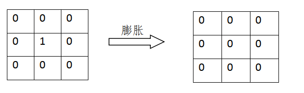
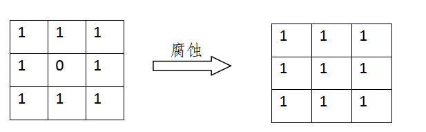
从上面我们可以看出，如果背景与图像的颜色互换，那么只需要将图像膨胀与腐蚀的与或运算相互颠倒即可。注意这种方法只适应于二值图像，膨胀和腐蚀， 都是针对于二值图像而言。

4. 最后在腐蚀后的基础上完成人脸的检测与定位，通过串口通信返回人脸在二维的四个坐标：`x_min ,x_max,y_min,y_max`

## 测试与分析

- 我们使用B站几位舞蹈区著up主欣小萌（女），咬人猫（女）和国内知名人物彭于晏（男），冯提莫（女），马云（男）以及本实验参与人员彭怡腾（男），钟书锐（男）的照片作为数据集进行训练。
其中用来训练的欣小萌，彭怡腾，钟书锐的照片分别如下

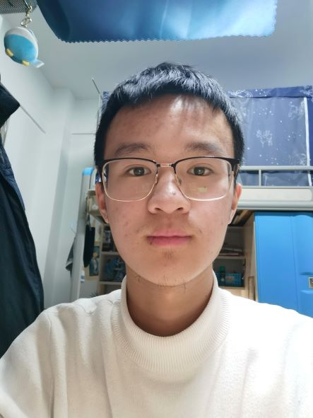
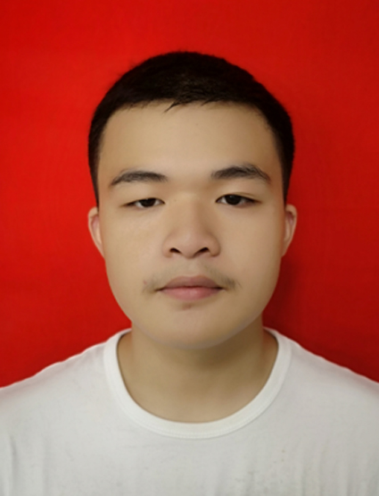
- 我们使用了现场拍摄的手机上的欣小萌的照片进行识别，使用的照片为下图
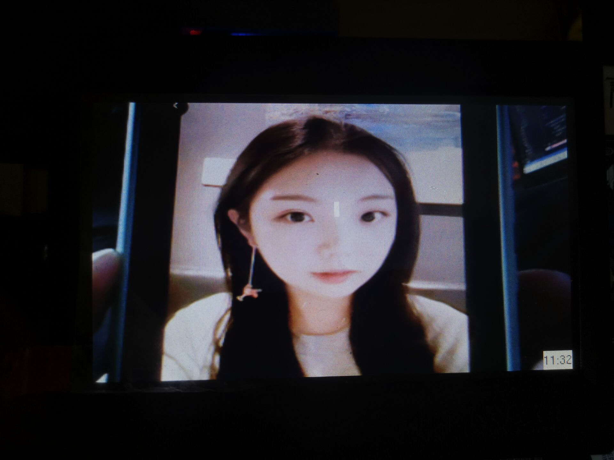
识别结果如下，获得8981分
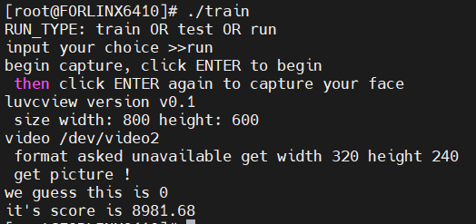
- 我们使用了现场拍摄的彭怡腾的照片进行识别，使用的照片为下图
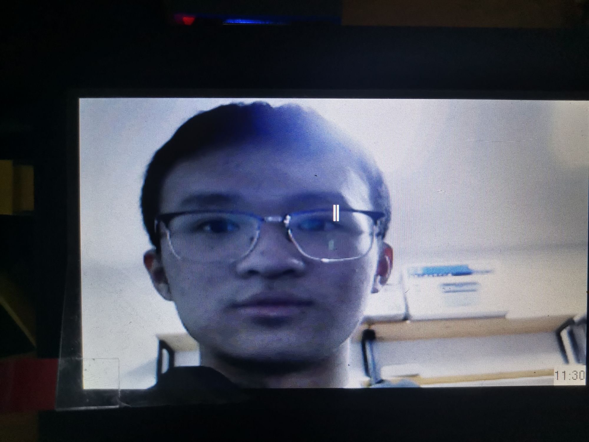
识别结果如下，获得4442分
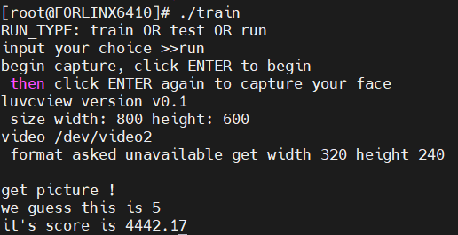
- 我们使用了现场拍摄的钟书锐的照片进行识别，使用的照片为下图
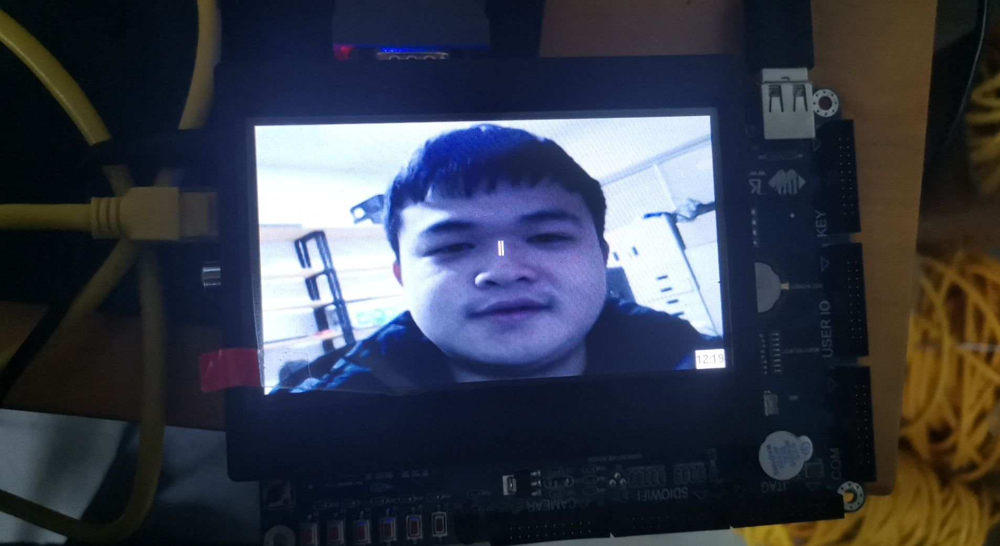
识别结果如下，获得7213分
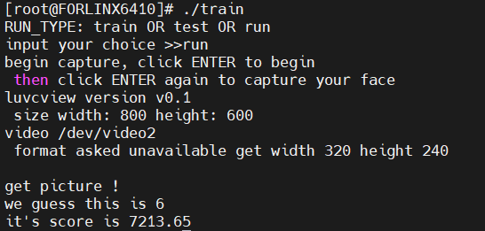
- 目前数据集不大导致准确率有时候可能高的问题

## 后续可能的改进与展望
-  由于该开发板只要一个串口进行通讯（已连接电脑用于输入命令行），我们无法使用FPGA通过串口测试我们的人脸检测模块。
-  同时目前FPGA其实并不常用于简单人人脸检测，而是神经网络与深度学习,后续可以考虑将人脸的训练移至FPGA开发板实现
-  同时我们人脸识别的算法只是较为简单的主成分分析的方法，并不是目前业界的主流，目前主要还是通过CNN神经网络来进行人脸识别
-  可使用数据库将用户的多种信息进行保存，并在输出时通过用户id查询用户信息，并在最终输出时输出用户信息，而非用户id

## 分工与贡献

| 姓名   | 贡献占比 |
| ------ | -------- |
| 钟书锐 | 50%      |
| 彭怡腾 | 50%      |

彭怡腾：
- 实验环境的搭建
- opencv安装
- opencv人脸识别的训练与实现

钟书锐：
- 摄像头模块的编写与接入
- 基于FPGA加速的人脸识别

## 参考文献
- 张榜，来金梅.一种基于FPGA的卷积神经网络加速器的设计与实现[J].复旦学报(自然科学版)，2018，57(2)：236-242.
- 王昆，周骅.基于深度学习的实时识别硬件系统框架设计[J].电子技术应用，2018，44(10)：11-14
- 丁帅帅，柴志雷.基于HLS的SURF特征提取硬件加速单元设计与实现[J].微电子学与计算机，2015（9）：133-137.
