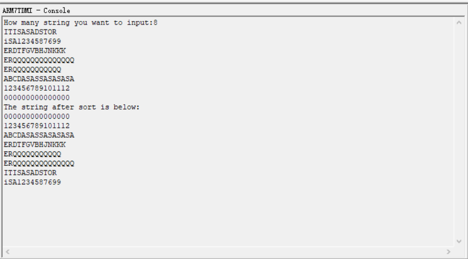

# 嵌入式系统设计方法-LAB1-字符串排序

- PB19000362
- 钟书锐

## 一、实验要求

- 字符串排序，从键盘输入至少 5 个字符串，每个字符串的长度不小于 10；经过排序之后，从小到大输出排序的结果。
- 在 ADS 的 console 中显示输出结果
- 使用 C 语言完成字符串的输入及输出
- 使用 ARM 汇编语言完成排序操作

## 二、实验环境

- 处理器 Intel(R) Core(TM) i7-10750H CPU @ 2.60GHz 2.59 GHz
- 操作系统 Windows 10
- ADS 1.2

## 三、实验思路

1. main.c

   - main 函数中定义结构体`struct string_sort`，结构体包含待排序的字符串数量，二维数组第二维大小和待排序的字符串

   ```
   struct string_sort
   {
       int num;
       int len;
       char s[MAXNUM][MAXSIZE];
   };
   ```

   - 首先读取用户输入的 num 信息，确定字符串数量。
   - 然后读取字符串并存储。
   - 调用 sort 进行排序。
   - 输出排序后的字符串集合。

2. sort.s

   - 采用冒泡排序的方式进行排序
   - 针对传入的 string_sort 类型的结构体，用 r1 存储 num，r2 存储 len，r3 存储二维数组的地址

   ```
   ldr     r1, [r0]            ;r1=num
   ldr     r2, [r0,#4]         ;r2=len
   add     r3, r0, #8          ;将r3指向s二维数组
   ```

   - 令 r4,r5 分别存储 i,j 进行冒泡排序，对应的逻辑代码如下

   ```
       for (i = 0; i < num - 1; i++)
           for (j = 0; j < num - 1 - i; j++)
   ```

   - 在 2 个循环中调用 compare 进行比较和交换，使用 r0,r1 传入等待比较的 2 个字符串的地址，同时 r2 一直存储着 len 信息

   ```
           STMFD   SP!,{R0-R6,lr}
           mul     r0, r2, r5
           add     r0, r0, r3          ;r0 指向第一个字符串
           add     r1, r0, r2          ;r1 指向第二个字符串
           bl      compare
           ldmfd   SP!,{R0-R6,lr}
   ```

3. compare.s

   - r0,r1 为传入的等待比较的 2 个字符串的地址。
   - r7 初始设置为 1，为排序的计数器。
   - 2 个字符串的每个字符依次进行比较。
   - 若前者的字符小于后者，或者 r7 计数器大于 len(代表 2 个字符串相等)，此时 2 个字符串不需要交换，直接返回，若前者的字符大于后者，则需要交换 2 个字符串的内容

   ```
   loop
        cmp     r7, r2
        bgt     end
        ldrb     r5, [r3]
        ldrb     r6, [r4]
        cmp     r5, r6
        blt     end             ;s1<s2
        bgt     exchange        ;s1>s2
        add     r3, r3, #1
        add     r4, r4, #1
        add     r7, r7, #1
        b       loop
   ```

   - 在本程序中采用交换内容，而非交换指针，符合冒泡排序一般性思路。
   - 交换字符串时，r7 设置为 1，为交换所用的计数器；r5，r6 为 2 个要交换的字符；r3，r4 指向要交换的地址。

   ```
    exchange
        mov     r7, #1          ;i=1
        mov     r3, r0
        mov     r4, r1

    loop_exchange
        cmp     r7, r2
        bgt     end
        ldrb    r5, [r3]
        ldrb    r6, [r4]
        strb    r5, [r4]
        strb    r6, [r3]
        add     r3, r3, #1
        add     r4, r4, #1
        add     r7, r7, #1
        b       loop_exchange

   ```

## 四、实验测试

- input：

  ```
  8
  ITISASADSTOR
  iSA1234587699
  ERDTFGVBHJNKKK
  ERQQQQQQQQQQQQQQ
  ERQQQQQQQQQQQ
  ABCDASASSASASASA
  123456789101112
  000000000000000
  ```

- output:

  ```
  The string after sort is below:
  000000000000000
  123456789101112
  ABCDASASSASASASA
  ERDTFGVBHJNKKK
  ERQQQQQQQQQQQ
  ERQQQQQQQQQQQQQQ
  ITISASADSTOR
  iSA1234587699
  ```

  

- 符合预期

## 五、性能分析

- 因为采用冒泡排序 时间复杂度为 O(n^2)
- 大多数时间复杂度为 O(nlgn)的算法(如堆排序)，在汇编层次上编写过于复杂

## 六、反思与总结

- 汇编代码的编写难点主要还是集中在循环的跳转时候需要理清各寄存器存储的内容
