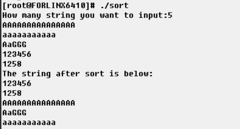

# 嵌入式系统设计方法-LAB3-开发板上运行编译好的文件
- PB19000362
- 钟书锐

## 一、实验要求

1. 将实验一中设计的字符串排序的代码，修改成gnu格式的代码，使用交叉编译器进行编译。
2. 生成的代码，利用网口，加载到开发板上面运行。

## 二、实验环境

- OK6410-A开发板
  - CPU:三星ARM11处理器S3C6410，主频533MHz/667MHz
  - 内存:256M Byte DDR SDRAM
  - FLASH:1G Byte SLCNand Flash
  - 系统支持:Android2.3、Linux2.6/3.0、WinCE6.0
- 处理器 Intel(R) Core(TM) i7-10750H CPU @ 2.60GHz 2.59 GHz
- VMware® Workstation 15 Pro (15.5.6 build-16341506)
- Linux ubuntu 5.11.0-40-generic #44~20.04.2-Ubuntu
- arm-linux-gnueabi-gcc (Ubuntu 10.3.0-1ubuntu1) 10.3.0

## 三、实验步骤
### 1.制作用于一键烧写Linux的SD卡(WinCE系统换Linux系统)
- 将SD卡格式化为FAT32格式，将SD卡接入SD读卡器中，把SD读卡器插在PC机的USB口中。
- 通过SD_Writer.exe将mmc.bin烧写到SD卡中，打开SD_Writer.exe。(mmc_ram256.bin)
- 将u-boot_ram256.bin拷贝到SD卡中，改名u-boot.bin。
- 将zImage拷贝到SD卡中。zImage是Linux的内核映像文件。
- 将rootfs.yaffs2拷贝到SD卡中。
  
### 2.烧写Linux到NandFlash中
- 拨码开关设置为SD卡启动
- 串口延长线连接平台的COM0和PC机的串口 
- 打开飞凌提供的DNW软件，设置好DNW的串口
- 烧写完成
- 拨码开关设置为Nandflash启动

### 3.将实验一中设计的字符串排序的代码，修改成gnu格式的代码，使用交叉编译器进行编译。
修改前的 compare.s
```s
    EXPORT compare
    AREA SUMMING, CODE, READONLY

compare
        mov     r3, r0
        mov     r4, r1
        mov     r7, #1          ;i=1      
loop
        cmp     r7, r2
        bgt     end 
        ldrb     r5, [r3]
        ldrb     r6, [r4]
        cmp     r5, r6    
        blt     end             ;s1<s2
        bgt     exchange        ;s1>s2
        add     r3, r3, #1
        add     r4, r4, #1
        add     r7, r7, #1
        b       loop


exchange
        mov     r7, #1          ;i=1
        mov     r3, r0
        mov     r4, r1

loop_exchange
        cmp     r7, r2
        bgt     end
        ldrb    r5, [r3]
        ldrb    r6, [r4]
        strb    r5, [r4]
        strb    r6, [r3]
        add     r3, r3, #1
        add     r4, r4, #1
        add     r7, r7, #1
        b       loop_exchange

end 
        mov     pc, lr
                END
```
修改后gnu格式的 compare.s
```
.text
        .align  2
.global compare
compare:
        mov     r3, r0
        mov     r4, r1
        mov     r7, #1          @i=1      
loop:
        cmp     r7, r2
        bgt     end 
        ldrb     r5, [r3]
        ldrb     r6, [r4]
        cmp     r5, r6    
        blt     end             @s1<s2
        bgt     exchange        @s1>s2
        add     r3, r3, #1
        add     r4, r4, #1
        add     r7, r7, #1
        b       loop


exchange:
        mov     r7, #1          @i=1
        mov     r3, r0
        mov     r4, r1

loop_exchange:
        cmp     r7, r2
        bgt     end
        ldrb    r5, [r3]
        ldrb    r6, [r4]
        strb    r5, [r4]
        strb    r6, [r3]
        add     r3, r3, #1
        add     r4, r4, #1
        add     r7, r7, #1
        b       loop_exchange

end:
        mov     pc, lr
        .end
```
修改前的 sort.s
```
    EXPORT sort
    IMPORT compare
    AREA SUMMING, CODE, READONLY

sort
        STMFD   SP!, {R4-R5}
        ldr     r1, [r0]            ;r1=num
        ldr     r2, [r0,#4]         ;r2=len
        add     r3, r0, #8          ;将r3指向s二维数组

        mov     r4, #0
        sub     r4, r4, #1          ;i=-1   
        sub     r1, r1, #1          ;r1=num-1
        
loop1                               ;冒泡排序
        add     r4, r4, #1          ;i++
        cmp     r1, r4              
        ble     back                ;if num-1<=i 返回
        mov     r5, #0              ;j=0
        sub     r6, r1, r4          ;r6=num-1-i
        
loop2   
        cmp     r6, r5              ;if num-1-i<=j 跳出第一重循环
        ble     loop1

        STMFD   SP!,{R0-R6,lr}
        mul     r0, r2, r5
        add     r0, r0, r3          ;r0 指向第一个字符串
        add     r1, r0, r2          ;r1 指向第二个字符串
        bl      compare
        ldmfd   SP!,{R0-R6,lr}

        add     r5, r5, #1          ;j++
        b       loop2

back
        ldmfd   SP!,{R4-R5}
        mov     pc,lr
        END
```
修改后gnu格式的 sort.s
```
.text
        .align  2
.global sort
sort:
        STMFD   SP!, {R4-R5}
        ldr     r1, [r0]            @r1=num
        ldr     r2, [r0,#4]         @r2=len
        add     r3, r0, #8          @将r3指向s二维数组

        mov     r4, #0
        sub     r4, r4, #1          @i=-1   
        sub     r1, r1, #1          @r1=num-1
        
loop1:                               @冒泡排序
        add     r4, r4, #1          @i++
        cmp     r1, r4              
        ble     back                @if num-1<=i 返回
        mov     r5, #0              @j=0
        sub     r6, r1, r4          @r6=num-1-i
        
loop2:   
        cmp     r6, r5              @if num-1-i<=j 跳出第一重循环
        ble     loop1

        STMFD   SP!,{R0-R6,lr}
        mul     r0, r2, r5
        add     r0, r0, r3          @r0 指向第一个字符串
        add     r1, r0, r2          @r1 指向第二个字符串
        bl      compare
        ldmfd   SP!,{R0-R6,lr}

        add     r5, r5, #1          @j++
        b       loop2

back:
        ldmfd   SP!,{R4-R5}
        mov     pc,lr
        .end
```

- 改写主要内容
  - 1. 注释从; 改为@
  - 2. 加入
    ```
    .text
        .align  2
    .global sort
    ```
    ```
    .text
        .align  2
    .global compare
    ```
  - 3. 删除 
    ```   
    EXPORT sort
    IMPORT compare
    AREA SUMMING, CODE, READONLY
    ```
    ```
    EXPORT compare
    AREA SUMMING, CODE, READONLY
    ``` 
  - 4. 标志符后面增加':'

- 编译
```
arm-linux-gnueabi-gcc -c -o main.o main.c
arm-linux-gnueabi-as -o sort.o sort.s
arm-linux-gnueabi-as -o compare.o compare.s
arm-linux-gnueabi-gcc -o sort main.o sort.o compare.o 
```

### 4.生成的代码，利用网口，加载到开发板上面运行。
- 通过FTP服务传输sort文件


## 四、反思与总结

- 难点主要在最开始开发板不是已经配置好的环境(新板子)
- 所以需要使用SDK写卡器，拷贝对应的文件，用于烧入linux系统
