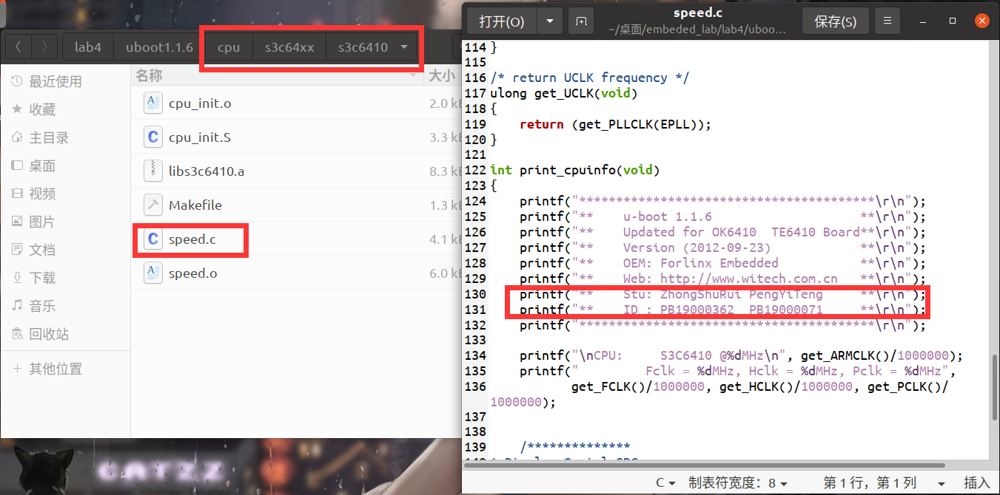
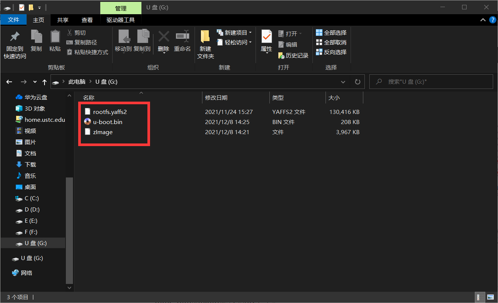
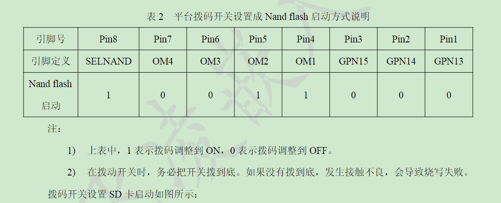
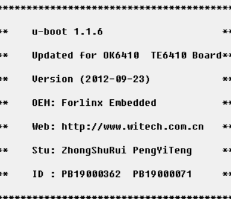

# 嵌入式系统设计方法-LAB4-uboot实验
- PB19000071 彭怡腾
- PB19000362 钟书锐


## 一、实验要求

1. 编译uboot，在开发板上面启动操作系统
2. 简要分析uboot的第二阶段文件，说明做了哪些工作

## 二、实验环境

- OK6410-A开发板
  - CPU:三星ARM11处理器S3C6410，主频533MHz/667MHz
  - 内存:256M Byte DDR SDRAM
  - FLASH:1G Byte SLCNand Flash
  - 系统支持:Android2.3、Linux2.6/3.0、WinCE6.0
- 处理器 Intel(R) Core(TM) i7-10750H CPU @ 2.60GHz 2.59 GHz
- 操作系统 Windows 10
- VMware® Workstation 15 Pro (15.5.6 build-16341506)
- Linux ubuntu 5.11.0-40-generic #44~20.04.2-Ubuntu
- 闪迪SDHC卡16G-Class4khf

## 三、实验步骤
### 1.编译uboot，在开发板上面启动操作系统
- 1、此步为编译操作：根据开发板启动时的信息`Updated for OK6410  TE6410 Board`，我们可以知道它在启动时展示的信息来自于如下路径的speed.c中的相关内容，于是将我们的学号和姓名信息填入此文件中并编译即可。



- 2、此后均为烧写过程：将SD卡插入读卡器并连接至电脑中，采用FAT32格式化。

- 3、以管理员模式打开开发板资料中提供的`SD_Writer.exe`软件，扫描到插入的SD卡后，将资料中提供的mmc_ram256.bin烧入到SD卡中。

- 4、将我们编译的uboot文件，以及资料中提供的对应的rootfs.yaffs2，zImage拖入SD卡中。



- 5、弹出SD卡并插入开发板上，将开发板上的BOOT SELECT的6，7开关拨至靠近显示屏一侧，使得开发板从SD卡启动。


- 6、上电，开始烧写，直至滴的一声，代表烧写完成。

- 7、将开发板上的BOOT SELECT的6，7开关拨至远离显示屏一侧，连接开发板和电脑串口，以便于看到输出的内容。在资料中提供的`dnw.exe`软件中，我们可以看到开发板启动时输出的内容如下：


### 2. 简要分析uboot的第二阶段文件，说明做了哪些工作
- 第二阶段启动阶段的主要工作:
- (1)初始化本阶段要使用到的硬件设备
- (2)检测系统内存映射(memory map) 
- (3)uboot命令的格式
- (4)为内核设置启动参数

- 第二阶段从lib_arm/board.c中的start_armboot函数开始
- 分析uboot1.1.6-V5.50-2014-09-19\uboot1.1.6\lib_arm\board.c
- 部分代码分析如下
```c
    init_fnc_t **init_fnc_ptr;
    char *s;
```
```c
typedef int (init_fnc_t) (void);
init_fnc_t *init_sequence[] = {
    cpu_init,               /* 与CPU相关的初始化 */
    board_init,             /* 与板子初始化相关的初始化 */
    interrupt_init,         /* 初始化定时器的 */
    env_init,               /* 初始化环境变量 */
    init_baudrate,          /* 初始化波特率设置 */
    serial_init,            /* serial通信相关初始化 */
    console_init_f,         /* console初始化的第一部分 */
    display_banner,         /* say that we are here */
    // ...
    dram_init,              /* 配置可用的RAM块 */
    display_dram_config,
    NULL,
};
```
- 首先init_fnc_ptr是一个函数指针。在后面的for循环中，将函数指针数组的首地址init_sequence赋值给init_fnc_ptr，然后循环，对所有的硬件进行初始化。
- cpu内部的初始化 我们在第一阶段进行的就是cpu内部初始化
- board_init    网卡、机器码、内存传参地址
- interrupt_init 初始化定时器
- env_init 初始化环境变量 
- init_baudrate 初始化波特率设置
...

```c
#ifdef CONFIG_MEMORY_UPPER_CODE /* by scsuh */
	ulong gd_base;

	gd_base = CFG_UBOOT_BASE + CFG_UBOOT_SIZE - CFG_MALLOC_LEN - CFG_STACK_SIZE - sizeof(gd_t);
#ifdef CONFIG_USE_IRQ
	gd_base -= (CONFIG_STACKSIZE_IRQ+CONFIG_STACKSIZE_FIQ);
#endif
	gd = (gd_t*)gd_base;
#else
	gd = (gd_t*)(_armboot_start - CFG_MALLOC_LEN - sizeof(gd_t));
#endif

	/* compiler optimization barrier needed for GCC >= 3.4 */
	__asm__ __volatile__("": : :"memory");

	memset ((void*)gd, 0, sizeof (gd_t));
	gd->bd = (bd_t*)((char*)gd - sizeof(bd_t));
	memset (gd->bd, 0, sizeof (bd_t));

	monitor_flash_len = _bss_start - _armboot_start;
```
- 以上代码进行内存使用排布
  
|分区|说明|
| ----------- | ----------- |
| uboot区     |CFG_UBOOT_BASE-xx（长度为uboot的实际长度）|     
| 堆区        |长度为CFG_MALLOC_LEN，实际为912KB|
|栈区	        |长度为CFG_STACK_SIZE，实际为512KB|
|gd	          |长度为sizeof(gd_t)，实际36字节|
|bd	          |长度为sizeof(bd_t)，实际为44字节左右|


- 分析uboot1.1.6-V5.50-2014-09-19\uboot1.1.6\comman\main.c
- main.c主要函数为main_loop
- 对 main_loop 进行简化 如下
```c
void main_loop (void)
{
    static char lastcommand[CFG_CBSIZE] = { 0, };
    int len;
    int rc = 1;
    int flag;
    char *s;
    int bootdelay;
    s = getenv ("bootdelay");               
    bootdelay = s ? (int)simple_strtol(s, NULL, 10) : CONFIG_BOOTDELAY;
    s = getenv ("bootcmd");
    if (!nobootdelay && bootdelay >= 0 && s && !abortboot (bootdelay)) {
        run_command (s, 0);
    }
    for (;;) {
        len = readline (CFG_PROMPT);
        flag = 0;
        if (len > 0)
            strcpy (lastcommand, console_buffer);
        else if (len == 0)
            flag |= CMD_FLAG_REPEAT;
        // ......其它代码
        if (len == -1)
            puts ("<INTERRUPT>\n");
        else
            rc = run_command (lastcommand, flag);

        if (rc <= 0) {
            lastcommand[0] = 0;  
        }
    }
}
```
- main_loop两种选择：
  1. 在bootdelay减到零之前敲下任意键将进入uboot控制界面（命令行模式）。

  2. 若倒计时结束前没有敲下任意键，将根据参数bootcmd来启动内核，getenv ("bootcmd")获得参数bootcmd值。
- 分析源码我们可以知道：
  - 通过`s = getenv ("bootdelay");` 获取延时时间。
  - 通过`s = getenv ("bootcmd");`获取引导命令。
  - 通过下面代码检查有没有敲下任意键
  ```
  #if defined CONFIG_ZERO_BOOTDELAY_CHECK
	/*
	 * Check if key already pressed
	 * Don't check if bootdelay < 0
	 */
	if (bootdelay >= 0) {
		if (tstc()) {	/* we got a key press	*/
			(void) getc();  /* consume input	*/
			puts ("\b\b\b 0");
			abort = 1; 	/* don't auto boot	*/
		}
	}
  #endif
  ```
  - 通过`if (!nobootdelay && bootdelay >= 0 && s && !abortboot (bootdelay))`判断延时时间是否到了：
    -  到了的话直接执行引导命令（`run_command (s, 0);`），对应倒计时结束前没有敲下任意键，将根据参数bootcmd来启动内核。
    - 如果在此期间有按键按下，则进入For循环，对应进入uboot控制界面（命令行模式）。
  - 在uboot控制界面（命令行模式）（代码的for循环中）
    - 此时通过`run_command (lastcommand, flag);`来执行命令。

## 四、反思与总结

- 难点主要在于分析uboot的第二阶段文件
- 学习了如何向SD卡烧写mmc并在开发板上通过SD卡启动系统，对开发板和嵌入式系统的启动有了更深的认识