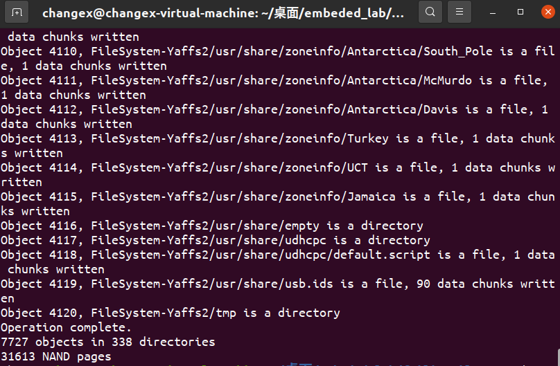
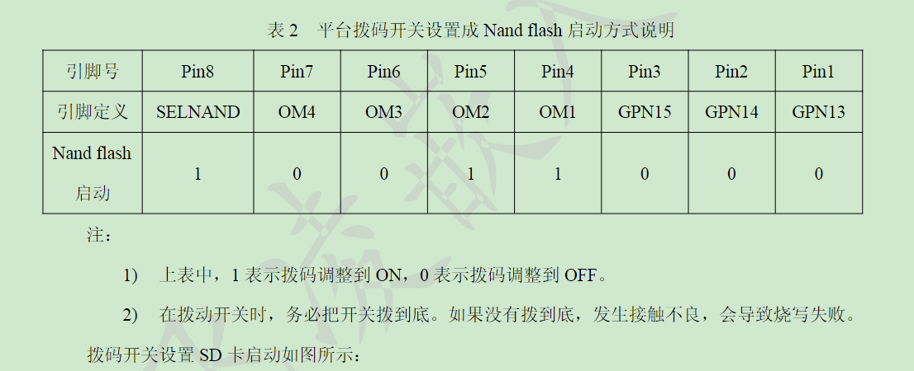
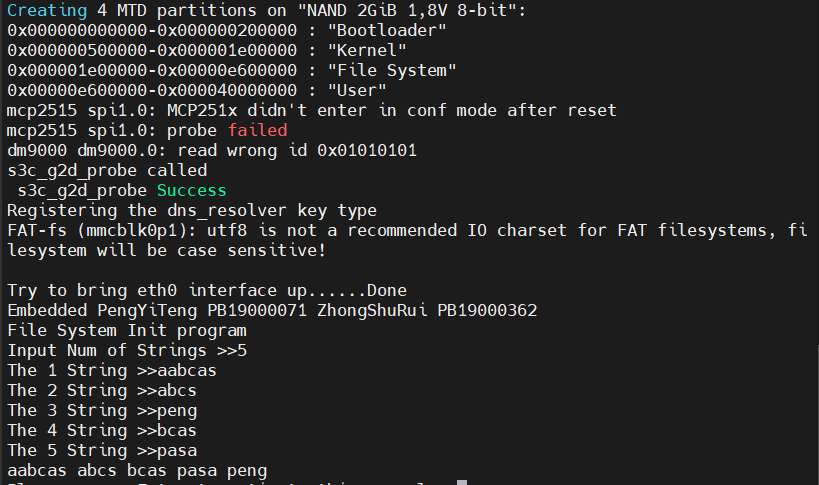

# 嵌入式系统设计方法-LAB5-busybox制作根文件系统
- PB19000071 彭怡腾
- PB19000362 钟书锐

## 一、实验要求

1. 基于busybox创建根文件系统
2. 在开发板上使用自己生成的文件系统,开机启动自己lab3中的字符串排序程序
3. 提交实验报告,需要包含详细的文件系统创建流程，包含如何实现开机启动自己的程序等

## 二、实验环境

- OK6410-A开发板
  - CPU:三星ARM11处理器S3C6410，主频533MHz/667MHz
  - 内存:256M Byte DDR SDRAM
  - FLASH:1G Byte SLCNand Flash
  - 系统支持:Android2.3、Linux2.6/3.0、WinCE6.0
- 处理器 Intel(R) Core(TM) i7-10750H CPU @ 2.60GHz 2.59 GHz
- 操作系统 Windows 10
- VMware® Workstation 15 Pro (15.5.6 build-16341506)
- Linux ubuntu 5.11.0-40-generic #44~20.04.2-Ubuntu
- 闪迪SDHC卡16G-Class4khf


## 三、实验背景

- Busybox
    - Busybox是一个开源项目，遵循GPL v2协议。Busybox将众多的UNIX命令集合进一个很小的可执行程序中。
    - Busybox中各种命令与相应的GNU工具相比，所能提供的选项比较少，Busybox主要用于嵌入式系统。

- YAFFS文件系统
    - YAFFS自带NAND芯片驱动，并为嵌入式系统提供了直接访问文件系统的API
    - YAFFS文件系统是专门针对NAND闪存设计的嵌入式文件系统，目前有YAFFS和YAFFS2两个版本，两个版本的主要区别之一在于YAFFS2能够更好的支持大容量的NAND FLASH芯片。
    - YAFFS文对文件系统上的所有内容（比如正常文件，目录，链接，设备文件等等）都统一当作文件来处理，每个文件都有一个页面专门存放文件头，文件头保存了文件的模式、所有者id、组id、长度、文件名、Parent Object ID等信息。因为需要在一页内放下这些内容，所以对文件名的长度，符号链接对象的路径名等长度都有限制。

## 三、实验步骤

### 1.制作根文件系统：利用busybox生成根文件系统

- （1）下载busybox
  ```bash
    cd ~/qianrushi
    wget https://busybox.net/downloads/busybox-1.32.1.tar.bz2 
    tar -jxvf busybox-1.32.1.tar.bz2 #解压
    cd ~/qianrushi/busybox-1.32.1
  ```
- （2）编译busybox
  ```bash
  make menuconfig #修改配置如下
  ```
  修改配置如下(空格键勾选)
  ```
  Settings –>
  Build Options
  [*] Build static binary（no share libs）
  ```
  编译并安装
  ```
  make -j8
  sudo make install
  ```
- （3）准备根文件系统
  ```
  cd ~/qianrushi/busybox-1.32.1/_install
  sudo mkdir dev
  sudo mknod dev/console c 5 1
  sudo mknod dev/ram b 1 0
  sudo touch init
  ```
  在init中写入以下内容
  ```
  #!/bin/sh
  echo "INIT SCRIPT"
  mkdir /proc
  mkdir /sys
  mount -t proc none /proc
  mount -t sysfs none /sys
  mkdir /tmp
  mount -t tmpfs none /tmp
  echo -e "\nThis boot took $(cut -d' ' -f1 /proc/uptime) seconds\n"
  exec /bin/sh
  ```
  赋予init脚本执行，制作initramfs文件，将x86-busybox下面的内容打包归档成cpio文件，以供Linux内核做initramfs启动执行
  ```
  sudo chmod +x init
  cd ~/qianrushi/busybox-1.32.1/_install
  find . -print0 | cpio --null -ov --format=newc | gzip -9 >
  ~/qianrushi/initramfs-busybox-x64.cpio.gz
  ```
- （4）根据开发板修改根文件系统
  - 解压initramfs-busybox-x64.cpio.gz
  ```
  gzip -d initramfs-busybox-x64.cpio.gz
  ```
  - 把开发板提供的文件系统源码中的部分内容有选择的添加到此文件夹中,使得开发版可以正常运行
- （5）制作映像
  - mkyaffs2image-nand2g制作出的映像，适用于1G，2G或者4G字节nandflash的平台
  - 运行下面命令在文件系统源码包同级目录下生成rootfs.yaffs2文件,此文件即是可以下载到平台nandflash中的yaffs2文件系统映像
  ```
  ./mkyaffs2image-nand2g initramfs-busybox-x64 rootfs.yaffs2
  ```
  
- (6)烧写
  - SD卡中原本有我们编译的uboot文件，以及资料中提供的对应的rootfs.yaffs2，zImage，将其中的rootfs.yaffs2 用 我们上面得到的 rootfs.yaffs2 替换
  - 弹出SD卡并插入开发板上，将开发板上的BOOT SELECT的6，7开关拨至靠近显示屏一侧，使得开发板从SD卡启动。
  
  - 上电，开始烧写，直至滴的一声，代表烧写完成。
  - 将开发板上的BOOT SELECT的6，7开关拨至远离显示屏一侧，连接开发板和电脑串口，以便于看到输出的内容。在Mobaxterm软件中，我们可以看到开发板启动时成功运行排序程序：
  - 
  